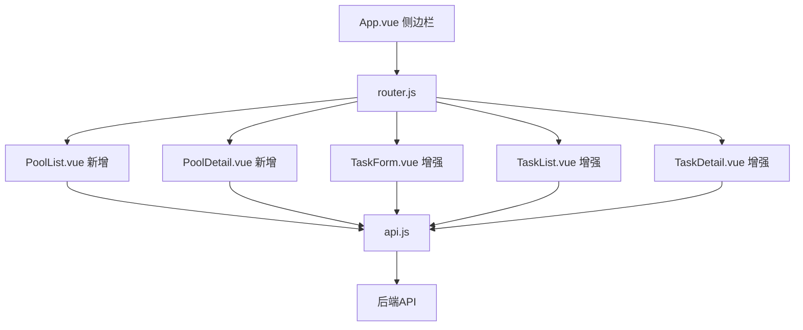

# 设计文档：高级DNS故障转移前端适配

## 概述

在现有Vue 3 + Element Plus前端基础上，新增解析池管理页面（PoolList.vue、PoolDetail.vue），增强现有的TaskForm.vue、TaskList.vue、TaskDetail.vue页面，更新App.vue侧边栏导航和router.js路由配置。所有修改遵循现有代码风格和模式。

## 架构



## 组件和接口

### 新增页面组件

#### PoolList.vue（解析池列表）
- 页面结构：页面头部（标题 + 创建按钮）+ 表格
- 表格列：池名称、资源类型、资源数量、操作（查看详情、删除）
- 创建对话框：el-dialog 包含表单（名称、资源类型、探测配置）
- API调用：GET /api/pools、POST /api/pools、DELETE /api/pools/:id

#### PoolDetail.vue（解析池详情）
- 页面结构：页面头部（池名称 + 返回按钮）+ 基本信息卡片 + 健康摘要 + 资源列表
- 基本信息：el-descriptions 展示池配置
- 健康摘要：统计卡片展示健康/不健康/总数
- 资源列表：el-table 展示资源值、健康状态、操作（移除）
- 添加资源对话框：el-dialog 包含资源值输入
- API调用：GET /api/pools/:id、GET /api/pools/:id/resources、GET /api/pools/:id/health、POST /api/pools/:id/resources、DELETE /api/pools/:id/resources/:resource_id

### 增强现有组件

#### TaskForm.vue 增强
新增表单字段：
- task_type：el-select（pause_delete / switch）
- record_type：el-select（A_AAAA / CNAME）
- pool_id：el-select（条件显示，加载池列表）
- switch_back_policy：el-select（auto / manual，仅switch类型显示）
- fail_threshold_type：el-select（count / percent，仅CNAME显示）
- fail_threshold_value：el-input-number（仅CNAME显示）

条件显示逻辑：
- pool_id：task_type === 'switch' 或 (task_type === 'pause_delete' && record_type === 'CNAME')
- switch_back_policy：task_type === 'switch'
- fail_threshold_type + fail_threshold_value：record_type === 'CNAME'

#### TaskList.vue 增强
新增表格列：
- 任务类型列：显示"暂停/删除"或"切换解析"
- 记录类型列：显示"A/AAAA"或"CNAME"
- 切换状态列：is_switched 为 true 时显示"已切换"标签

#### TaskDetail.vue 增强
- 基本信息区域：新增任务类型、记录类型、解析池、回切策略字段
- 切换状态卡片：当 is_switched 为 true 时显示原始值和当前值
- CNAME信息标签页：当 record_type === 'CNAME' 时显示，展示目标IP、健康状态、失败计数、阈值
- 操作日志筛选增强：新增 operation_type 下拉筛选和时间范围选择器

### 路由和导航

#### router.js 新增路由
```javascript
{ path: '/pools', name: 'PoolList', component: () => import('./views/PoolList.vue') }
{ path: '/pools/:id', name: 'PoolDetail', component: () => import('./views/PoolDetail.vue') }
```

#### App.vue 侧边栏新增
在"探测任务"菜单项后添加"解析池"菜单项，使用 Collection 图标。
activeMenu 计算属性增加 /pools 路径匹配。

## 数据模型

### 解析池（Pool）
```typescript
interface Pool {
  id: number
  name: string
  resource_type: string        // 'ip' | 'domain'
  probe_protocol: string
  probe_port: number
  probe_interval_sec: number
  timeout_ms: number
  fail_threshold: number
  recover_threshold: number
  created_at: string
}
```

### 池资源（PoolResource）
```typescript
interface PoolResource {
  id: number
  pool_id: number
  value: string               // IP地址或域名
  health_status: string       // 'healthy' | 'unhealthy' | 'unknown'
  last_probe: string
  latency_ms: number
}
```

### 池健康摘要（PoolHealth）
```typescript
interface PoolHealth {
  total: number
  healthy: number
  unhealthy: number
}
```

### 扩展任务字段
```typescript
interface TaskExtended {
  // ... 现有字段
  task_type: string            // 'pause_delete' | 'switch'
  record_type: string          // 'A_AAAA' | 'CNAME'
  pool_id: number | null
  switch_back_policy: string   // 'auto' | 'manual'
  original_value: string
  current_value: string
  is_switched: boolean
  fail_threshold_type: string  // 'count' | 'percent'
  fail_threshold_value: number
}
```

### CNAME信息
```typescript
interface CnameInfo {
  targets: Array<{
    ip: string
    health_status: string
    latency_ms: number
  }>
  failed_count: number
  threshold: number
}
```

## 正确性属性

*正确性属性是在系统所有有效执行中应保持为真的特征或行为——本质上是关于系统应该做什么的形式化声明。*

由于本功能为纯前端UI适配，主要涉及页面渲染和API调用，不涉及复杂的数据转换或业务逻辑计算，因此不定义属性测试。前端正确性通过手动验证和集成测试保证。

## 错误处理

- API调用失败时使用 ElMessage.error 显示中文错误提示
- 删除解析池被引用时显示后端返回的具体错误信息
- 表单验证失败时通过 el-form 规则显示字段级错误
- 页面加载失败时显示加载状态并提示重试
- 遵循现有的401拦截器自动跳转登录页逻辑

## 测试策略

本功能为前端UI适配，依赖手动验证和热重载实时预览：
- 每个页面修改后通过浏览器热重载验证渲染效果
- 验证条件显示逻辑（任务类型切换时表单字段的显隐）
- 验证API调用参数的正确性
- 验证路由导航和菜单高亮的正确性
