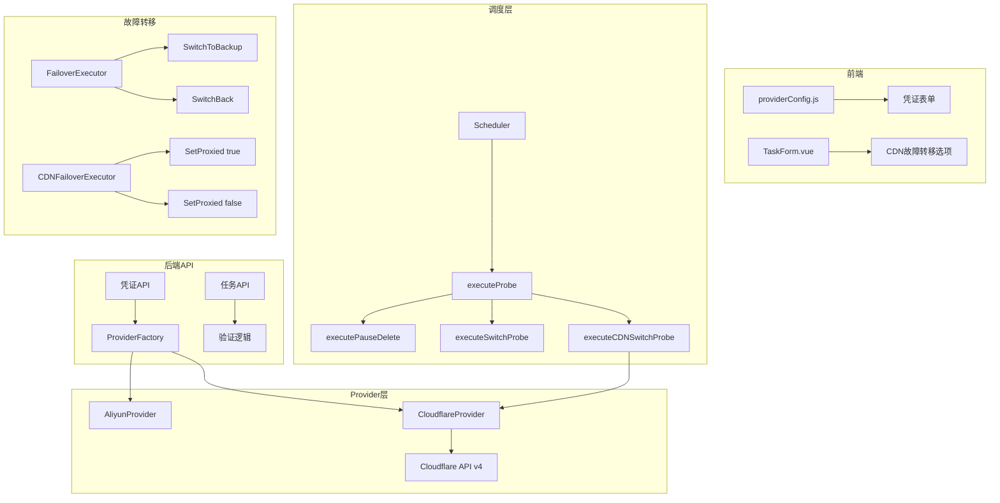
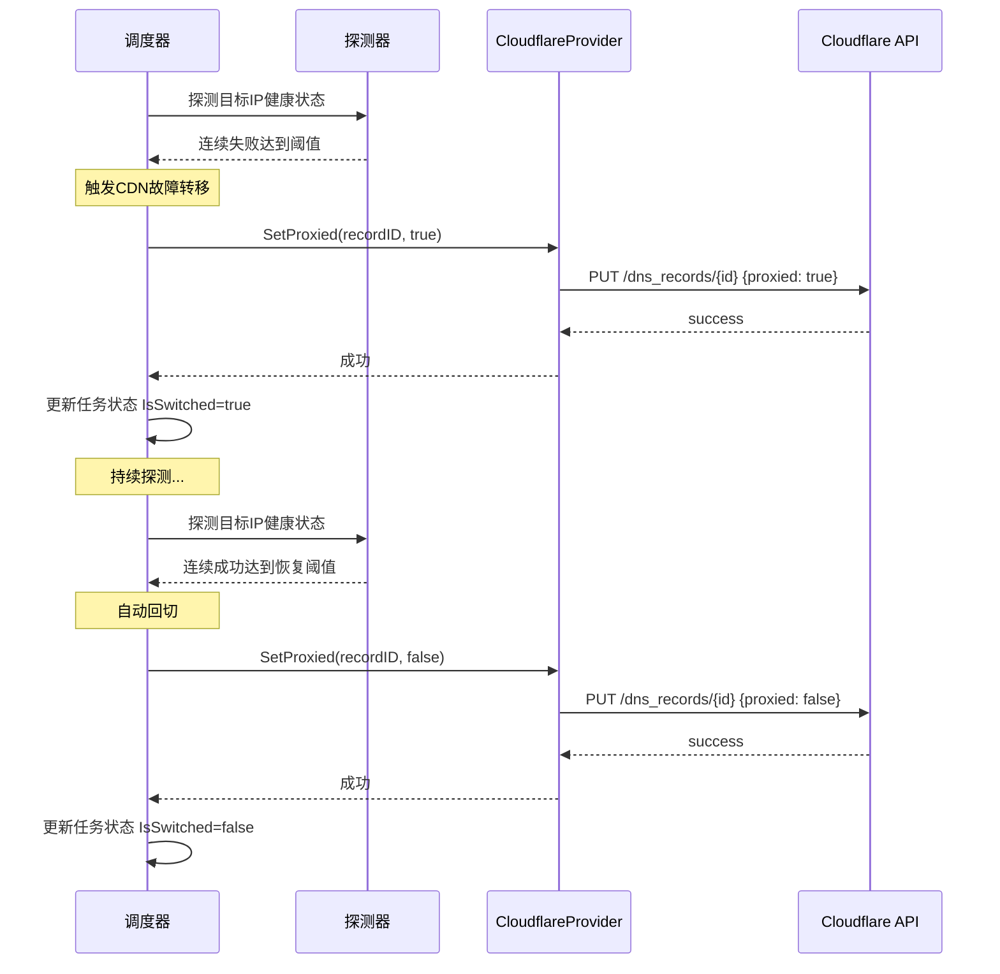

# 设计文档：Cloudflare DNS Provider 及 CDN 故障转移

## 概述

本设计为 DNS 健康监控系统新增 Cloudflare DNS 服务商支持，包含三个核心部分：

1. **Cloudflare DNS Provider**：实现 `DNSProvider` 接口，对接 Cloudflare API v4
2. **Proxied 控制能力**：扩展接口支持 Cloudflare CDN 代理开关控制
3. **CDN 故障转移模式**：新增 `cdn_switch` 任务类型，通过 proxied 字段实现故障转移

## 架构

### 整体架构图



### CDN 故障转移流程



## 组件与接口

### 1. CloudflareProvider（`internal/provider/cloudflare/client.go`）

实现 `DNSProvider` 接口，并额外提供 proxied 控制方法。

```go
// CloudflareDNSClient Cloudflare DNS 客户端
type CloudflareDNSClient struct {
    apiToken string
    client   *http.Client
}

// NewCloudflareDNSClient 创建 Cloudflare DNS 客户端
func NewCloudflareDNSClient(apiToken string) *CloudflareDNSClient

// DNSProvider 接口实现
func (c *CloudflareDNSClient) SupportsPause() bool                    // 返回 false
func (c *CloudflareDNSClient) ListRecords(ctx, domain, subDomain, recordType) ([]DNSRecord, error)
func (c *CloudflareDNSClient) AddRecord(ctx, domain, subDomain, recordType, value, ttl) (string, error)
func (c *CloudflareDNSClient) UpdateRecord(ctx, recordID, subDomain, recordType, value, ttl) error
func (c *CloudflareDNSClient) PauseRecord(ctx, recordID) error       // 返回不支持错误
func (c *CloudflareDNSClient) ResumeRecord(ctx, recordID) error      // 返回不支持错误
func (c *CloudflareDNSClient) DeleteRecord(ctx, recordID) error
func (c *CloudflareDNSClient) UpdateRecordValue(ctx, recordID, newValue) error
func (c *CloudflareDNSClient) GetRecordValue(ctx, recordID) (string, error)

// Cloudflare 独有方法 - CDN 代理控制
func (c *CloudflareDNSClient) SetProxied(ctx context.Context, recordID string, proxied bool) error
func (c *CloudflareDNSClient) GetProxied(ctx context.Context, recordID string) (bool, error)

// 内部辅助方法
func (c *CloudflareDNSClient) getZoneID(ctx context.Context, domain string) (string, error)
func (c *CloudflareDNSClient) doRequest(ctx context.Context, method, url string, body interface{}, result interface{}) error
```

Zone ID 缓存策略：使用 `sync.Map` 缓存 domain → zoneID 映射，避免每次操作都查询 Zone ID。

### 2. ProxiedController 接口

为了让调度器能够在不知道具体 provider 类型的情况下调用 proxied 控制方法，定义一个可选接口：

```go
// ProxiedController CDN 代理控制接口（可选实现）
// 仅 Cloudflare 等支持 CDN 代理的服务商需要实现
type ProxiedController interface {
    SetProxied(ctx context.Context, recordID string, proxied bool) error
    GetProxied(ctx context.Context, recordID string) (bool, error)
}
```

调度器通过类型断言检查 provider 是否实现了此接口：

```go
if pc, ok := prov.(provider.ProxiedController); ok {
    pc.SetProxied(ctx, recordID, true)
}
```

### 3. ProviderFactory 扩展（`main.go`）

在 `createProviderFactory` 中新增 cloudflare case：

```go
case "cloudflare":
    apiToken := fields["api_token"]
    if apiToken == "" {
        return nil, fmt.Errorf("Cloudflare 凭证缺少 api_token")
    }
    return cloudflare.NewCloudflareDNSClient(apiToken), nil
```

### 4. 前端 ProviderConfig 扩展（`web/src/providerConfig.js`）

```javascript
cloudflare: {
    label: 'Cloudflare',
    fields: [
        {
            key: 'api_token',
            label: 'API Token',
            placeholder: '请输入 Cloudflare API Token',
            type: 'password',
            required: true
        }
    ]
}
```

### 5. 调度器 CDN 故障转移逻辑

在 `executeProbe` 中新增 `cdn_switch` 任务类型分发：

```go
case model.TaskTypeCDNSwitch:
    s.executeCDNSwitchProbe(ctx, runner, prov)
```

`executeCDNSwitchProbe` 流程：
1. 获取当前 DNS 记录列表
2. 对记录指向的 IP 进行健康探测
3. 连续失败达到阈值 → 调用 `SetProxied(recordID, true)` 启用 CDN
4. 已切换且恢复健康 → 根据回切策略调用 `SetProxied(recordID, false)` 关闭 CDN

## 数据模型

### ProbeTask 扩展

```go
// 新增任务类型常量
const TaskTypeCDNSwitch TaskType = "cdn_switch"

// ProbeTask 新增字段
type ProbeTask struct {
    // ... 现有字段 ...
    CDNTarget string // CDN 故障转移的 CNAME 目标值（仅 cdn_switch 类型使用）
}
```

### 验证函数扩展

```go
// IsValidTaskType 新增 cdn_switch 支持
func IsValidTaskType(t string) bool {
    switch TaskType(t) {
    case TaskTypePauseDelete, TaskTypeSwitch, TaskTypeCDNSwitch:
        return true
    default:
        return false
    }
}
```

### 数据库迁移

GORM AutoMigrate 会自动处理新增字段 `CDNTarget`，无需手动迁移。

## 正确性属性

*正确性属性是指在系统所有有效执行中都应保持为真的特征或行为——本质上是关于系统应该做什么的形式化陈述。属性作为人类可读规范和机器可验证正确性保证之间的桥梁。*

### Property 1: Bearer Token 认证一致性

*对于任意* Cloudflare API 请求，请求头中的 Authorization 字段应始终为 `Bearer <token>` 格式，且 token 值与创建客户端时传入的 apiToken 一致。

**Validates: Requirements 1.2**

### Property 2: API 错误响应传播

*对于任意* Cloudflare API 返回的错误响应（success=false 或 HTTP 状态码 >= 300），CloudflareProvider 的对应方法应返回非 nil 的 error，且错误信息包含中文描述。

**Validates: Requirements 1.11, 2.5**

### Property 3: UpdateRecordValue 属性不变量

*对于任意* DNS 记录，调用 UpdateRecordValue 后，记录的 type、name、proxied、ttl 属性应保持不变，仅 content 字段被更新为新值。同理，CDN 切换操作（SetProxied）仅修改 proxied 字段，content 值保持不变。

**Validates: Requirements 1.9, 4.8**

### Property 4: ProviderFactory Cloudflare 支持

*对于任意* 非空的 api_token 字符串，ProviderFactory 在接收 provider_type 为 "cloudflare" 的凭证时，应成功创建 CloudflareProvider 实例且不返回错误。

**Validates: Requirements 3.3**

### Property 5: CDN 故障转移触发

*对于任意* cdn_switch 类型任务，当探测目标连续失败次数达到失败阈值时，系统应将对应记录的 proxied 设为 true，并将任务状态标记为 IsSwitched=true。

**Validates: Requirements 4.3, 4.5**

### Property 6: CDN 自动回切

*对于任意* 已切换（IsSwitched=true）且回切策略为 auto 的 cdn_switch 类型任务，当探测目标恢复健康（连续成功达到恢复阈值）时，系统应将对应记录的 proxied 设回 false，并将任务状态标记为 IsSwitched=false。

**Validates: Requirements 4.4**

### Property 7: cdn_switch 任务类型凭证约束

*对于任意* 创建 cdn_switch 类型任务的请求，当关联凭证的 provider_type 不是 "cloudflare" 时，任务 API 应拒绝创建并返回错误。

**Validates: Requirements 4.7, 6.1, 6.2**

## 错误处理

| 错误场景 | 处理方式 |
|---------|---------|
| API Token 无效/过期 | 返回 HTTP 401/403 错误，包含中文提示"Cloudflare API 认证失败" |
| Zone 未找到 | 返回"未找到域名 {domain} 对应的 Zone"错误 |
| DNS 记录不存在 | 返回"未找到指定的 DNS 记录"错误 |
| 网络超时 | 返回"Cloudflare API 请求超时"错误 |
| HTTP 状态码 >= 300 | 解析响应体中的错误信息，返回"Cloudflare API 错误: {详情}" |
| SetProxied 失败 | 返回"更新 CDN 代理状态失败: {详情}"错误 |
| cdn_switch 任务关联非 Cloudflare 凭证 | 返回"CDN 故障转移仅支持 Cloudflare 服务商"错误 |
| cdn_switch 任务缺少 CDNTarget | 返回"CDN 故障转移任务必须指定 CNAME 目标值"错误 |

## 测试策略

### 单元测试

- CloudflareProvider 各方法的 mock HTTP 测试（使用 `httptest.NewServer`）
- ProviderFactory cloudflare case 的正常和异常路径
- `IsValidTaskType` 新增 cdn_switch 的验证
- `validateTaskRequest` 新增 cdn_switch 相关验证逻辑
- CDN 故障转移执行逻辑的 mock 测试

### 属性测试

使用 Go 的 `testing/quick` 或 `pgregory.net/rapid` 库进行属性测试：

- **Property 2**: 生成随机错误状态码和错误消息，验证所有错误响应都被正确传播
- **Property 3**: 生成随机 DNS 记录状态，验证 UpdateRecordValue 和 SetProxied 的不变量
- **Property 5**: 生成随机阈值和失败序列，验证故障转移触发条件
- **Property 6**: 生成随机已切换任务和恢复序列，验证自动回切条件
- **Property 7**: 生成随机 provider_type（非 cloudflare），验证 cdn_switch 创建被拒绝

每个属性测试至少运行 100 次迭代。

测试标签格式：**Feature: cloudflare-dns-provider, Property {N}: {property_text}**

### 测试分层

按照用户规则，测试分为功能测试和全量测试：
- 新功能开发阶段：仅运行 Cloudflare 相关的功能测试
- 测试文件在测试完毕后删除

