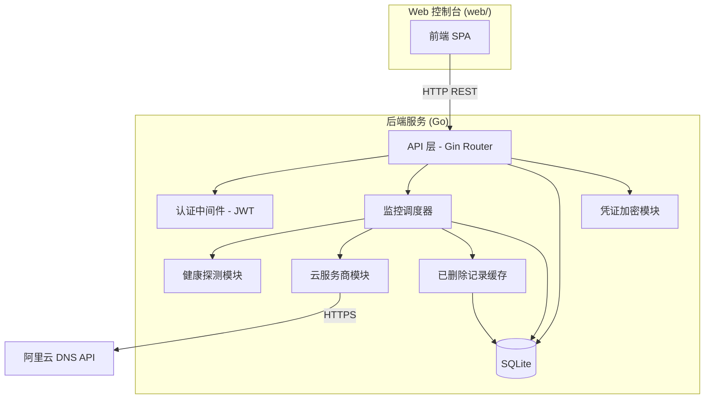
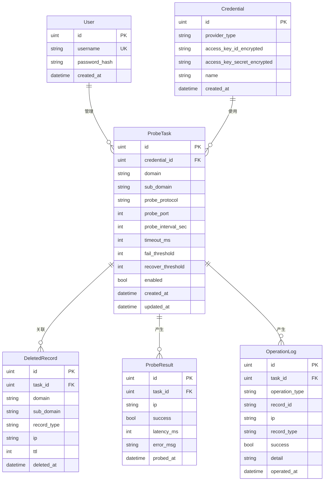

# 设计文档

## 概述

DNS 健康检测自动暂停/恢复系统采用 Go 语言开发，整体架构分为后端 API 服务和前端 Web 控制台两部分。后端采用模块化设计，核心模块包括健康探测器（prober）、云服务商对接（provider）、监控调度器（scheduler）和 Web API 层。前端为独立目录的 SPA 应用。数据持久化使用 SQLite，轻量且无需额外部署数据库服务。

## 架构

### 整体架构图



### 目录结构

```
dns-health-monitor/
├── main.go                  # 程序入口
├── go.mod
├── go.sum
├── config.yaml              # 应用配置（端口、加密密钥路径等）
├── internal/
│   ├── model/               # 数据模型定义
│   │   └── model.go
│   ├── database/            # 数据库初始化与访问
│   │   └── database.go
│   ├── prober/              # 健康探测模块
│   │   ├── prober.go        # 探测接口定义
│   │   ├── icmp.go
│   │   ├── tcp.go
│   │   ├── udp.go
│   │   ├── http.go
│   │   └── https.go
│   ├── provider/            # 云服务商对接模块
│   │   ├── provider.go      # 统一接口定义
│   │   └── aliyun/
│   │       ├── client.go    # 阿里云 DNS 客户端
│   │       └── signer.go    # HMAC-SHA1 签名
│   ├── scheduler/           # 监控调度器
│   │   └── scheduler.go
│   ├── cache/               # 已删除记录缓存
│   │   └── cache.go
│   ├── crypto/              # 凭证加密模块
│   │   └── crypto.go
│   └── api/                 # Web API 层
│       ├── router.go        # 路由定义
│       ├── middleware.go    # JWT 认证中间件
│       ├── auth.go          # 登录/登出接口
│       ├── task.go          # 探测任务 CRUD
│       ├── credential.go   # 凭证管理
│       ├── status.go        # 状态与历史查询
│       └── dto.go           # 请求/响应 DTO
├── web/                     # 前端独立目录
│   ├── index.html
│   ├── package.json
│   └── src/
│       ├── main.js
│       ├── api.js           # API 调用封装
│       ├── router.js        # 前端路由
│       ├── views/
│       │   ├── Login.vue
│       │   ├── Dashboard.vue
│       │   ├── TaskList.vue
│       │   ├── TaskForm.vue
│       │   ├── TaskDetail.vue
│       │   └── Credentials.vue
│       └── components/
│           └── ...
└── data/                    # 运行时数据目录
    └── dns-monitor.db       # SQLite 数据库文件
```

### 技术选型

| 组件 | 技术 | 理由 |
|------|------|------|
| Web 框架 | Gin | Go 生态最流行的 HTTP 框架，性能好，中间件丰富 |
| 数据库 | SQLite (go-sqlite3) | 轻量嵌入式，无需额外部署，适合单机工具 |
| ORM | GORM | Go 主流 ORM，支持 SQLite，减少手写 SQL |
| 认证 | JWT (golang-jwt) | 无状态令牌，适合 REST API |
| 前端 | Vue 3 + Vite | 轻量 SPA 框架，开发体验好 |
| UI 库 | Element Plus | Vue 3 生态成熟的 UI 组件库，中文友好 |
| ICMP | go-ping | 成熟的 ICMP ping 库 |
| 加密 | Go 标准库 crypto/aes + crypto/cipher | AES-GCM 加密，无需第三方依赖 |

## 组件与接口

### 1. 健康探测模块 (prober)

```go
// ProbeProtocol 探测协议类型
type ProbeProtocol string

const (
    ProbeICMP  ProbeProtocol = "ICMP"
    ProbeTCP   ProbeProtocol = "TCP"
    ProbeUDP   ProbeProtocol = "UDP"
    ProbeHTTP  ProbeProtocol = "HTTP"
    ProbeHTTPS ProbeProtocol = "HTTPS"
)

// ProbeResult 探测结果
type ProbeResult struct {
    Success  bool
    Latency  time.Duration
    Time     time.Time
    Error    string
}

// Prober 探测器接口
type Prober interface {
    Probe(ctx context.Context, target string, port int, timeout time.Duration) ProbeResult
}

// NewProber 根据协议创建对应探测器
func NewProber(protocol ProbeProtocol) Prober
```

每种协议实现 `Prober` 接口：
- `ICMPProber`：使用 go-ping 发送 ICMP Echo
- `TCPProber`：使用 `net.DialTimeout` 建立 TCP 连接
- `UDPProber`：使用 `net.DialTimeout("udp", ...)` 发送 UDP 包
- `HTTPProber`：使用 `http.Client` 发送 HTTP GET，状态码 2xx/3xx 为健康
- `HTTPSProber`：同 HTTPProber，使用 HTTPS scheme

### 2. 云服务商对接模块 (provider)

```go
// DNSRecord 统一 DNS 记录结构
type DNSRecord struct {
    RecordID   string
    DomainName string
    SubDomain  string
    Type       string // "A" 或 "AAAA"
    Value      string // IP 地址
    TTL        int
    Status     string // "ENABLE" / "DISABLE"
}

// DNSProvider 云服务商统一接口
type DNSProvider interface {
    // SupportsPause 返回该服务商是否支持暂停/启用操作
    SupportsPause() bool

    // ListRecords 查询主机记录的所有记录
    ListRecords(ctx context.Context, domain, subDomain, recordType string) ([]DNSRecord, error)

    // AddRecord 添加 DNS 记录，返回记录 ID
    AddRecord(ctx context.Context, domain, subDomain, recordType, value string, ttl int) (string, error)

    // UpdateRecord 更新 DNS 记录
    UpdateRecord(ctx context.Context, recordID, subDomain, recordType, value string, ttl int) error

    // PauseRecord 暂停 DNS 记录（仅支持暂停的服务商可用）
    PauseRecord(ctx context.Context, recordID string) error

    // ResumeRecord 启用 DNS 记录（仅支持暂停的服务商可用）
    ResumeRecord(ctx context.Context, recordID string) error

    // DeleteRecord 删除 DNS 记录
    DeleteRecord(ctx context.Context, recordID string) error
}
```

阿里云实现 `AliyunDNSClient`：
- `SupportsPause()` 返回 `true`（阿里云支持 SetDomainRecordStatus）
- 所有 API 调用通过 `signer.go` 中的 HMAC-SHA1 签名器签名
- API 端点：`https://alidns.aliyuncs.com/`，版本：`2015-01-09`

### 3. 监控调度器 (scheduler)

```go
// Scheduler 监控调度器
type Scheduler struct {
    db          *gorm.DB
    cache       *DeletedRecordCache
    providers   map[uint]provider.DNSProvider  // credentialID -> provider
    tasks       map[uint]*taskRunner           // taskID -> runner
    mu          sync.RWMutex
}

// taskRunner 单个任务的运行器
type taskRunner struct {
    task     model.ProbeTask
    cancel   context.CancelFunc
    counters map[string]*ipCounter  // IP -> 连续成功/失败计数
}

// ipCounter IP 探测计数器
type ipCounter struct {
    ConsecutiveFails    int
    ConsecutiveSuccesses int
    CurrentStatus       string // "healthy" / "unhealthy" / "paused" / "deleted"
}

// Start 启动调度器，加载所有任务
func (s *Scheduler) Start(ctx context.Context) error

// AddTask 添加新的探测任务
func (s *Scheduler) AddTask(task model.ProbeTask) error

// UpdateTask 更新探测任务配置
func (s *Scheduler) UpdateTask(task model.ProbeTask) error

// RemoveTask 移除探测任务
func (s *Scheduler) RemoveTask(taskID uint) error
```

调度逻辑（每个任务独立 goroutine）：
1. 按配置周期触发 ticker
2. 从 DNSProvider 获取当前域名记录
3. 合并 DeletedRecordCache 中的已删除记录
4. 对每个 IP 执行健康探测
5. 更新连续成功/失败计数
6. 达到失败阈值：检查是否为最后一条记录 → 是则跳过，否则根据 `SupportsPause()` 决定暂停或删除
7. 达到恢复阈值：已暂停的执行启用，已删除的执行添加并从缓存移除
8. 记录探测结果和操作日志到数据库

### 4. 已删除记录缓存 (cache)

```go
// DeletedRecordCache 已删除记录缓存
type DeletedRecordCache struct {
    db *gorm.DB
}

// Add 添加已删除记录
func (c *DeletedRecordCache) Add(record model.DeletedRecord) error

// Remove 移除已恢复的记录
func (c *DeletedRecordCache) Remove(taskID uint, ip string) error

// ListByTask 获取某任务下所有已删除记录
func (c *DeletedRecordCache) ListByTask(taskID uint) ([]model.DeletedRecord, error)

// CleanByTask 清理某任务的所有已删除记录
func (c *DeletedRecordCache) CleanByTask(taskID uint) error
```

### 5. 凭证加密模块 (crypto)

```go
// Encrypt 使用 AES-GCM 加密明文
func Encrypt(plaintext string, key []byte) (string, error)

// Decrypt 使用 AES-GCM 解密密文
func Decrypt(ciphertext string, key []byte) (string, error)

// MaskSecret 脱敏显示（前四位 + **** + 后四位）
func MaskSecret(secret string) string
```

加密密钥从配置文件或环境变量读取，长度 32 字节（AES-256）。

### 6. Web API 层 (api)

| 方法 | 路径 | 说明 | 认证 |
|------|------|------|------|
| POST | /api/login | 用户登录 | 否 |
| POST | /api/logout | 用户登出 | 是 |
| GET | /api/tasks | 获取探测任务列表 | 是 |
| POST | /api/tasks | 创建探测任务 | 是 |
| PUT | /api/tasks/:id | 更新探测任务 | 是 |
| DELETE | /api/tasks/:id | 删除探测任务 | 是 |
| GET | /api/tasks/:id | 获取任务详情（含 IP 状态） | 是 |
| GET | /api/tasks/:id/history | 获取探测历史 | 是 |
| GET | /api/tasks/:id/logs | 获取操作日志 | 是 |
| GET | /api/credentials | 获取凭证列表（脱敏） | 是 |
| POST | /api/credentials | 添加凭证 | 是 |
| DELETE | /api/credentials/:id | 删除凭证 | 是 |

JWT 认证中间件：
- 登录成功后返回 JWT token（有效期可配置，默认 24 小时）
- 受保护接口需在 `Authorization: Bearer <token>` 头中携带 token
- 中间件验证 token 有效性，无效则返回 401

## 数据模型

### ER 图



### GORM 模型定义

```go
// User 用户
type User struct {
    ID           uint   `gorm:"primaryKey"`
    Username     string `gorm:"uniqueIndex;not null"`
    PasswordHash string `gorm:"not null"`
    CreatedAt    time.Time
}

// Credential 云服务商凭证
type Credential struct {
    ID                      uint   `gorm:"primaryKey"`
    ProviderType            string `gorm:"not null"` // "aliyun"
    Name                    string `gorm:"not null"`
    AccessKeyIDEncrypted    string `gorm:"not null"`
    AccessKeySecretEncrypted string `gorm:"not null"`
    CreatedAt               time.Time
}

// ProbeTask 探测任务
type ProbeTask struct {
    ID               uint   `gorm:"primaryKey"`
    CredentialID     uint   `gorm:"not null"`
    Domain           string `gorm:"not null"`
    SubDomain        string `gorm:"not null"` // "@" 表示根域名
    ProbeProtocol    string `gorm:"not null"` // ICMP/TCP/UDP/HTTP/HTTPS
    ProbePort        int
    ProbeIntervalSec int    `gorm:"not null"`
    TimeoutMs        int    `gorm:"not null"`
    FailThreshold    int    `gorm:"not null"`
    RecoverThreshold int    `gorm:"not null"`
    Enabled          bool   `gorm:"not null;default:true"`
    CreatedAt        time.Time
    UpdatedAt        time.Time
}

// DeletedRecord 已删除记录缓存
type DeletedRecord struct {
    ID         uint   `gorm:"primaryKey"`
    TaskID     uint   `gorm:"index;not null"`
    Domain     string `gorm:"not null"`
    SubDomain  string `gorm:"not null"`
    RecordType string `gorm:"not null"` // "A" / "AAAA"
    IP         string `gorm:"not null"`
    TTL        int    `gorm:"not null"`
    DeletedAt  time.Time
}

// ProbeResult 探测结果
type ProbeResult struct {
    ID        uint   `gorm:"primaryKey"`
    TaskID    uint   `gorm:"index;not null"`
    IP        string `gorm:"not null"`
    Success   bool   `gorm:"not null"`
    LatencyMs int
    ErrorMsg  string
    ProbedAt  time.Time `gorm:"index"`
}

// OperationLog 操作日志
type OperationLog struct {
    ID            uint   `gorm:"primaryKey"`
    TaskID        uint   `gorm:"index;not null"`
    OperationType string `gorm:"not null"` // "pause"/"delete"/"resume"/"add"
    RecordID      string
    IP            string `gorm:"not null"`
    RecordType    string `gorm:"not null"`
    Success       bool   `gorm:"not null"`
    Detail        string
    OperatedAt    time.Time `gorm:"index"`
}
```


## 正确性属性

*正确性属性是一种在系统所有有效执行中都应成立的特征或行为——本质上是关于系统应该做什么的形式化陈述。属性是人类可读规范与机器可验证正确性保证之间的桥梁。*

### Property 1: HTTP/HTTPS 状态码判定

*For any* HTTP 或 HTTPS 探测请求，当响应状态码在 200-399 范围内时，探测结果应为成功；当状态码在此范围外时，探测结果应为失败。

**Validates: Requirements 1.4, 1.5**

### Property 2: 超时导致探测失败

*For any* 探测协议和任意超时配置值，当目标在超时时间内未响应时，探测结果的 Success 字段应为 false。

**Validates: Requirements 1.6**

### Property 3: 探测结果结构完整性

*For any* 探测操作（无论成功或失败），返回的 ProbeResult 应包含非零的 Time 字段、非负的 Latency 字段，且 Success 字段与实际探测情况一致。

**Validates: Requirements 1.7**

### Property 4: IP 列表合并完整性

*For any* 在线 DNS 记录列表和已删除记录缓存列表，合并后的待探测 IP 列表应包含两个列表中所有唯一 IP 地址，且不遗漏任何一个。

**Validates: Requirements 3.2**

### Property 5: 失败阈值触发正确操作

*For any* 探测任务和任意 IP，当连续探测失败次数达到配置的失败阈值时：若 DNS_Provider 的 SupportsPause() 返回 true，则应执行暂停操作；若返回 false，则应执行删除操作并将记录存入 Deleted_Record_Cache。

**Validates: Requirements 3.3, 3.4**

### Property 6: 恢复阈值触发恢复操作

*For any* 已暂停或已删除的 IP，当连续探测成功次数达到配置的恢复阈值时，应触发恢复操作（已暂停的执行启用，已删除的执行重新添加）。

**Validates: Requirements 3.5**

### Property 7: 已删除记录缓存 Round-Trip

*For any* 被删除的 DNS 记录，存入 Deleted_Record_Cache 后，通过 ListByTask 查询应能获取到该记录，且记录的域名、主机记录、记录类型、IP 和 TTL 与存入时一致。

**Validates: Requirements 3.6, 3.7**

### Property 8: 最后一条记录保护

*For any* 域名，当该域名下仅剩一条活跃的 DNS 解析记录时，即使该 IP 探测失败达到阈值，Monitor_Scheduler 也不应执行暂停或删除操作。

**Validates: Requirements 3.8**

### Property 9: 过期 JWT Token 拒绝

*For any* 已过期的 JWT token，认证中间件应返回 401 状态码，拒绝访问受保护资源。

**Validates: Requirements 4.4**

### Property 10: 探测任务数值参数验证

*For any* 探测任务配置，当探测周期、超时时间、失败阈值或恢复阈值为非正整数（零、负数或非数字）时，验证应失败并拒绝创建。

**Validates: Requirements 5.2**

### Property 11: 探测历史时间倒序

*For any* 探测历史查询结果，返回的记录列表应按探测时间严格倒序排列（即每条记录的时间戳大于等于下一条）。

**Validates: Requirements 6.3**

### Property 12: AES-GCM 加密 Round-Trip

*For any* 有效的明文字符串和 32 字节加密密钥，使用 Encrypt 加密后再使用 Decrypt 解密，应得到与原始明文完全相同的字符串。

**Validates: Requirements 8.2**

### Property 13: 凭证脱敏显示

*For any* 长度大于等于 8 的密钥字符串，MaskSecret 函数应返回仅包含前四个字符、星号和后四个字符的字符串，且返回结果中不包含原始字符串的中间部分。

**Validates: Requirements 8.3**

## 错误处理

### 健康探测错误

| 错误场景 | 处理方式 |
|----------|----------|
| ICMP 权限不足（需要 root） | 记录错误日志，标记探测失败，提示用户检查权限 |
| TCP/UDP 连接超时 | 标记探测失败，记录超时时间 |
| HTTP/HTTPS 请求失败（DNS 解析失败、连接拒绝等） | 标记探测失败，记录具体错误信息 |
| HTTP/HTTPS TLS 证书错误 | 标记探测失败，记录证书错误详情 |

### 云服务商 API 错误

| 错误场景 | 处理方式 |
|----------|----------|
| 认证失败（InvalidAccessKeyId） | 记录错误日志，标记任务异常，不重试 |
| 签名错误（SignatureDoesNotMatch） | 记录错误日志，标记任务异常 |
| API 限流（Throttling） | 指数退避重试，最多 3 次 |
| 网络超时 | 重试 1 次，仍失败则跳过本轮操作 |
| 记录不存在（DomainRecordNotExist） | 暂停/启用操作时忽略，从缓存中清理 |
| 记录冲突（DomainRecordDuplicate） | 添加操作时查询已有记录并更新 |

### 调度器错误

| 错误场景 | 处理方式 |
|----------|----------|
| 获取 DNS 记录失败 | 跳过本轮探测，等待下一周期 |
| 数据库写入失败 | 记录错误日志，探测结果暂存内存，下次写入 |
| Provider 实例创建失败（凭证解密失败） | 标记任务异常，通知用户检查凭证 |

### Web API 错误

| 错误场景 | 处理方式 |
|----------|----------|
| 未认证访问 | 返回 401 Unauthorized |
| 参数验证失败 | 返回 400 Bad Request，附带具体错误字段 |
| 资源不存在 | 返回 404 Not Found |
| 服务器内部错误 | 返回 500，记录错误日志，不暴露内部细节 |

## 测试策略

### 测试框架

- 单元测试：Go 标准库 `testing`
- 属性测试：`github.com/leanovate/gopter`（Go 生态成熟的属性测试库）
- HTTP 测试：`net/http/httptest`
- Mock：`github.com/stretchr/testify/mock`

### 双重测试方法

本项目采用单元测试 + 属性测试的双重策略：

- **单元测试**：验证具体示例、边界情况和错误条件
- **属性测试**：验证跨所有输入的通用属性

两者互补：单元测试捕获具体 bug，属性测试验证通用正确性。

### 属性测试配置

- 每个属性测试最少运行 100 次迭代
- 每个属性测试必须用注释引用设计文档中的属性编号
- 注释格式：`// Feature: dns-health-monitor, Property N: 属性描述`
- 每个正确性属性由一个独立的属性测试实现

### 测试分层

| 层级 | 测试内容 | 测试类型 |
|------|----------|----------|
| prober | 各协议探测逻辑 | 单元测试 + 属性测试（Property 1-3） |
| crypto | AES-GCM 加密解密、脱敏 | 属性测试（Property 12-13） |
| cache | 已删除记录缓存 CRUD | 属性测试（Property 7） |
| scheduler | 阈值判定、IP 合并、最后记录保护 | 属性测试（Property 4-6, 8） |
| provider/aliyun | API 请求构造、签名 | 单元测试 |
| api | 认证中间件、参数验证、CRUD 接口 | 单元测试 + 属性测试（Property 9-11） |

### 测试隔离

- 云服务商 API 调用使用 mock HTTP server（httptest）
- 数据库测试使用内存 SQLite（`:memory:`）
- 网络探测测试使用本地 mock server
- 每个新功能只运行该功能的测试，最终做全量测试
