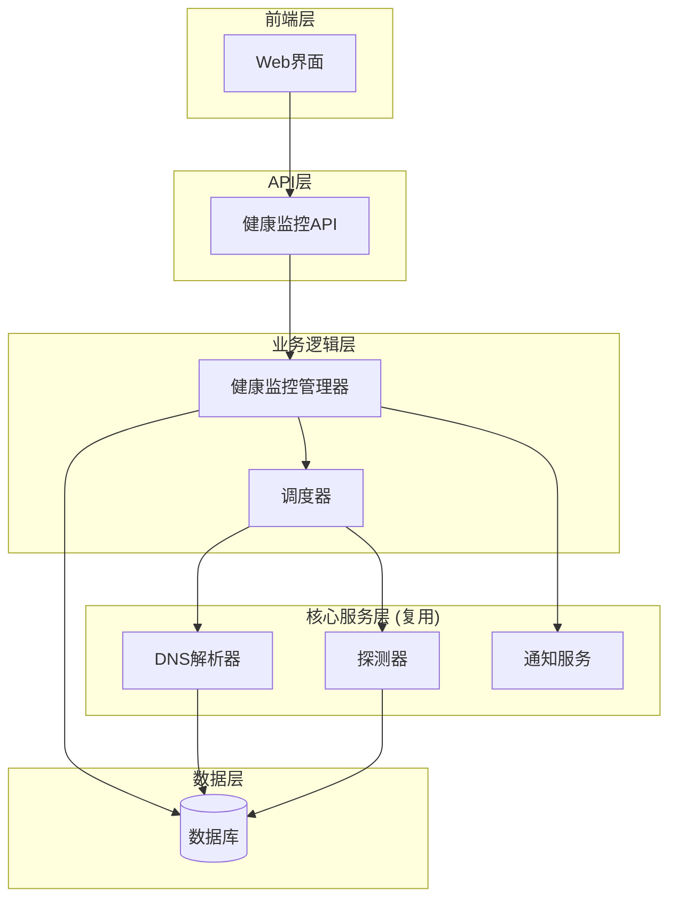
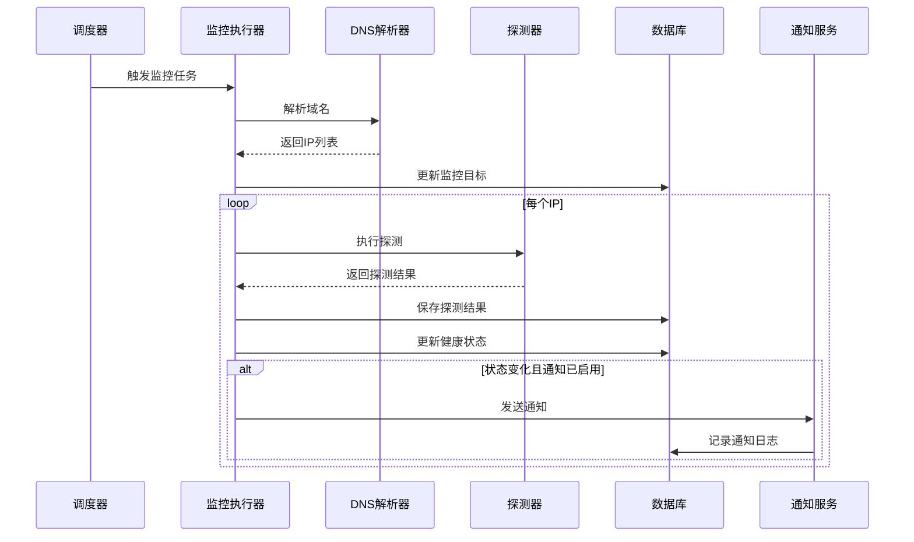

# 设计文档

## 概述

DNS健康监控功能是一个轻量级的监控系统,专注于DNS解析监控和健康状态跟踪,不涉及故障转移操作。该功能复用现有的DNS解析器、探测器和通知系统,通过独立的数据模型实现与探测任务的隔离。

核心设计原则:
- 复用现有组件(DNS解析器、探测器、通知服务)
- 数据隔离(独立的数据表,不影响探测任务)
- 只读监控(不执行任何DNS记录修改操作)
- 灵活配置(支持多种记录类型和探测协议)

## 架构

### 系统架构图



### 组件职责

1. **Web界面**: 提供用户交互界面,管理监控任务
2. **健康监控API**: 处理HTTP请求,验证输入,调用业务逻辑
3. **健康监控管理器**: 管理监控任务生命周期,协调各组件
4. **调度器**: 定期触发DNS解析和健康探测
5. **DNS解析器**: 解析域名获取IP地址列表(复用现有)
6. **探测器**: 执行健康探测(复用现有)
7. **通知服务**: 发送告警通知(复用现有)
8. **数据库**: 持久化存储监控任务和探测结果

## 组件和接口

### 数据模型

#### HealthMonitorTask (健康监控任务)

```go
type HealthMonitorTask struct {
    ID           uint   `gorm:"primaryKey"`
    CredentialID uint   `gorm:"not null"`        // 云服务商凭证ID
    Domain       string `gorm:"not null"`        // 主域名
    SubDomain    string `gorm:"not null"`        // 子域名
    RecordType   string `gorm:"not null"`        // 记录类型: A/AAAA/A_AAAA/CNAME
    
    // 探测配置
    ProbeProtocol    string `gorm:"not null"`   // 探测协议: ICMP/TCP/UDP/HTTP/HTTPS
    ProbePort        int                         // 探测端口
    ProbeIntervalSec int    `gorm:"not null"`   // 探测间隔(秒)
    TimeoutMs        int    `gorm:"not null"`   // 超时时间(毫秒)
    FailThreshold    int    `gorm:"not null"`   // 失败阈值
    RecoverThreshold int    `gorm:"not null"`   // 恢复阈值
    
    // CNAME专用字段
    FailThresholdType  string `gorm:"default:'count'"` // 阈值类型: count/percent
    FailThresholdValue int    `gorm:"default:1"`       // 阈值数值
    
    // 状态
    Enabled   bool `gorm:"not null;default:true"`
    CreatedAt time.Time
    UpdatedAt time.Time
}
```

#### HealthMonitorTarget (监控目标IP)

```go
type HealthMonitorTarget struct {
    ID         uint   `gorm:"primaryKey"`
    TaskID     uint   `gorm:"index;not null"`      // 所属任务ID
    CNAMEValue string `gorm:"default:''"`          // CNAME记录值(仅CNAME类型)
    IP         string `gorm:"not null"`            // IP地址
    
    // 健康状态
    HealthStatus         string     `gorm:"not null;default:'unknown'"` // healthy/unhealthy/unknown
    ConsecutiveFails     int        `gorm:"default:0"`                  // 连续失败次数
    ConsecutiveSuccesses int        `gorm:"default:0"`                  // 连续成功次数
    AvgLatencyMs         int        `gorm:"default:0"`                  // 平均延迟(最近10次)
    LastProbeAt          *time.Time                                     // 最后探测时间
    
    CreatedAt time.Time
    UpdatedAt time.Time
}
```

#### HealthMonitorResult (探测结果)

```go
type HealthMonitorResult struct {
    ID        uint   `gorm:"primaryKey"`
    TaskID    uint   `gorm:"index;not null"`  // 任务ID
    IP        string `gorm:"not null"`        // IP地址
    Success   bool   `gorm:"not null"`        // 是否成功
    LatencyMs int                             // 延迟(毫秒)
    ErrorMsg  string                          // 错误信息
    ProbedAt  time.Time `gorm:"index"`       // 探测时间
}
```

### API接口

#### 创建监控任务

```
POST /api/health-monitors
Content-Type: application/json
Authorization: Bearer <token>

Request:
{
    "credential_id": 1,
    "domain": "example.com",
    "sub_domain": "www",
    "record_type": "A",
    "probe_protocol": "ICMP",
    "probe_port": 0,
    "probe_interval_sec": 60,
    "timeout_ms": 3000,
    "fail_threshold": 3,
    "recover_threshold": 2,
    "fail_threshold_type": "count",
    "fail_threshold_value": 1
}

Response:
{
    "code": 0,
    "message": "success",
    "data": {
        "id": 1,
        "credential_id": 1,
        "domain": "example.com",
        "sub_domain": "www",
        "record_type": "A",
        "enabled": true,
        "created_at": "2024-01-01T00:00:00Z"
    }
}
```

#### 查询任务列表

```
GET /api/health-monitors
Authorization: Bearer <token>

Response:
{
    "code": 0,
    "message": "success",
    "data": [
        {
            "id": 1,
            "domain": "example.com",
            "sub_domain": "www",
            "record_type": "A",
            "enabled": true,
            "target_count": 3,
            "healthy_count": 2,
            "unhealthy_count": 1
        }
    ]
}
```

#### 查询任务详情

```
GET /api/health-monitors/:id
Authorization: Bearer <token>

Response:
{
    "code": 0,
    "message": "success",
    "data": {
        "id": 1,
        "credential_id": 1,
        "domain": "example.com",
        "sub_domain": "www",
        "record_type": "A",
        "probe_protocol": "ICMP",
        "enabled": true,
        "targets": [
            {
                "id": 1,
                "ip": "1.2.3.4",
                "health_status": "healthy",
                "consecutive_fails": 0,
                "consecutive_successes": 5,
                "avg_latency_ms": 25,
                "last_probe_at": "2024-01-01T00:00:00Z"
            }
        ]
    }
}
```

#### 更新任务

```
PUT /api/health-monitors/:id
Content-Type: application/json
Authorization: Bearer <token>

Request:
{
    "probe_interval_sec": 120,
    "fail_threshold": 5
}

Response:
{
    "code": 0,
    "message": "success"
}
```

#### 暂停任务

```
POST /api/health-monitors/:id/pause
Authorization: Bearer <token>

Response:
{
    "code": 0,
    "message": "success"
}
```

#### 恢复任务

```
POST /api/health-monitors/:id/resume
Authorization: Bearer <token>

Response:
{
    "code": 0,
    "message": "success"
}
```

#### 删除任务

```
DELETE /api/health-monitors/:id
Authorization: Bearer <token>

Response:
{
    "code": 0,
    "message": "success"
}
```

#### 查询探测结果历史

```
GET /api/health-monitors/:id/results?start_time=2024-01-01T00:00:00Z&end_time=2024-01-02T00:00:00Z
Authorization: Bearer <token>

Response:
{
    "code": 0,
    "message": "success",
    "data": [
        {
            "ip": "1.2.3.4",
            "success": true,
            "latency_ms": 25,
            "probed_at": "2024-01-01T00:00:00Z"
        }
    ]
}
```

### 核心业务逻辑

#### 健康监控管理器接口

```go
type HealthMonitorManager interface {
    // CreateTask 创建监控任务
    CreateTask(task *HealthMonitorTask) error
    
    // UpdateTask 更新监控任务
    UpdateTask(id uint, updates map[string]interface{}) error
    
    // DeleteTask 删除监控任务
    DeleteTask(id uint) error
    
    // PauseTask 暂停监控任务
    PauseTask(id uint) error
    
    // ResumeTask 恢复监控任务
    ResumeTask(id uint) error
    
    // GetTask 获取任务详情
    GetTask(id uint) (*HealthMonitorTask, error)
    
    // ListTasks 获取任务列表
    ListTasks() ([]*HealthMonitorTask, error)
    
    // GetTaskTargets 获取任务的所有监控目标
    GetTaskTargets(taskID uint) ([]*HealthMonitorTarget, error)
}
```

#### 监控执行流程

```go
// MonitorExecutor 监控执行器
type MonitorExecutor struct {
    db       *gorm.DB
    resolver DNSResolver
    prober   Prober
    notifier Notifier
}

// Execute 执行一次监控周期
func (e *MonitorExecutor) Execute(task *HealthMonitorTask) error {
    // 1. DNS解析获取IP列表
    ips, err := e.resolveDNS(task)
    if err != nil {
        return err
    }
    
    // 2. 更新监控目标列表
    err = e.updateTargets(task.ID, ips)
    if err != nil {
        return err
    }
    
    // 3. 对每个IP执行探测
    targets := e.getActiveTargets(task.ID)
    for _, target := range targets {
        result := e.probeTarget(task, target)
        
        // 4. 保存探测结果
        e.saveResult(task.ID, target.IP, result)
        
        // 5. 更新健康状态
        e.updateHealthStatus(target, result)
        
        // 6. 检查是否需要发送通知
        e.checkAndNotify(task, target)
    }
    
    return nil
}
```

## 数据模型

### 数据库表结构

#### health_monitor_tasks 表

| 字段 | 类型 | 说明 |
|------|------|------|
| id | INTEGER | 主键 |
| credential_id | INTEGER | 凭证ID |
| domain | TEXT | 主域名 |
| sub_domain | TEXT | 子域名 |
| record_type | TEXT | 记录类型 |
| probe_protocol | TEXT | 探测协议 |
| probe_port | INTEGER | 探测端口 |
| probe_interval_sec | INTEGER | 探测间隔 |
| timeout_ms | INTEGER | 超时时间 |
| fail_threshold | INTEGER | 失败阈值 |
| recover_threshold | INTEGER | 恢复阈值 |
| fail_threshold_type | TEXT | 阈值类型 |
| fail_threshold_value | INTEGER | 阈值数值 |
| enabled | BOOLEAN | 是否启用 |
| created_at | DATETIME | 创建时间 |
| updated_at | DATETIME | 更新时间 |

#### health_monitor_targets 表

| 字段 | 类型 | 说明 |
|------|------|------|
| id | INTEGER | 主键 |
| task_id | INTEGER | 任务ID |
| cname_value | TEXT | CNAME值 |
| ip | TEXT | IP地址 |
| health_status | TEXT | 健康状态 |
| consecutive_fails | INTEGER | 连续失败次数 |
| consecutive_successes | INTEGER | 连续成功次数 |
| avg_latency_ms | INTEGER | 平均延迟 |
| last_probe_at | DATETIME | 最后探测时间 |
| created_at | DATETIME | 创建时间 |
| updated_at | DATETIME | 更新时间 |

#### health_monitor_results 表

| 字段 | 类型 | 说明 |
|------|------|------|
| id | INTEGER | 主键 |
| task_id | INTEGER | 任务ID |
| ip | TEXT | IP地址 |
| success | BOOLEAN | 是否成功 |
| latency_ms | INTEGER | 延迟 |
| error_msg | TEXT | 错误信息 |
| probed_at | DATETIME | 探测时间 |

### 数据流图



## 正确性属性

*属性是一个特征或行为,应该在系统的所有有效执行中保持为真——本质上是关于系统应该做什么的形式化陈述。属性作为人类可读规范和机器可验证正确性保证之间的桥梁。*

### 属性 1: DNS解析结果完整性

*对于任何*有效的域名和记录类型,DNS解析器返回的IP列表应该包含该域名在DNS系统中的所有解析记录

**验证需求: 2.2, 2.3, 2.4, 2.5**

### 属性 2: 探测结果一致性

*对于任何*监控目标IP,如果探测成功,则必须记录延迟值;如果探测失败,则必须记录错误信息

**验证需求: 3.7, 3.8, 5.3**

### 属性 3: 健康状态转换正确性

*对于任何*监控目标,当连续失败次数达到失败阈值时,健康状态必须从健康或未知变为不健康;当连续成功次数达到恢复阈值时,健康状态必须从不健康变为健康

**验证需求: 4.1, 4.2, 4.4, 4.5**

### 属性 4: 监控目标列表同步性

*对于任何*监控任务,当DNS解析返回新的IP地址时,该IP必须被添加到监控目标列表;当某个IP不再出现在解析结果中时,该IP必须从监控目标列表中移除

**验证需求: 2.7, 2.8**

### 属性 5: 通知触发条件正确性

*对于任何*启用通知的监控任务,当且仅当IP状态发生变化(健康↔不健康)或连续失败达到阈值时,系统才应该发送通知

**验证需求: 6.1, 6.2, 6.3, 6.4**

### 属性 6: CNAME解析链完整性

*对于任何*CNAME类型的监控任务,系统必须先解析CNAME记录值,再解析CNAME指向的所有IP地址,并保持CNAME值与IP的映射关系

**验证需求: 8.1, 8.2, 8.3, 8.4**

### 属性 7: 数据隔离性

*对于任何*健康监控操作,系统不应该修改探测任务(ProbeTask)表中的任何记录,也不应该触发任何DNS记录的修改操作

**验证需求: 9.1, 9.2, 9.3**

### 属性 8: API响应一致性

*对于任何*API请求,如果操作成功,响应代码必须为0;如果操作失败,响应代码必须非0且包含错误信息

**验证需求: 10.9**

### 属性 9: 任务状态管理正确性

*对于任何*监控任务,当任务被暂停时,系统必须停止该任务的所有DNS解析和探测活动;当任务被恢复时,系统必须重新启动这些活动

**验证需求: 7.1, 7.2, 7.5**

### 属性 10: 平均延迟计算准确性

*对于任何*监控目标,其平均延迟值应该等于最近10次成功探测的延迟平均值

**验证需求: 4.6**

## 错误处理

### DNS解析错误

- **场景**: DNS解析失败或超时
- **处理**: 记录错误日志,在下个探测周期重试,不影响其他任务
- **用户反馈**: 在任务详情中显示"DNS解析失败"状态

### 探测超时

- **场景**: 探测请求超过配置的超时时间
- **处理**: 将探测标记为失败,记录超时错误,更新连续失败计数
- **用户反馈**: 在探测结果中显示"超时"错误

### 数据库错误

- **场景**: 数据库连接失败或写入失败
- **处理**: 记录错误日志,跳过当前周期,在下个周期重试
- **用户反馈**: 系统日志中记录详细错误信息

### 通知发送失败

- **场景**: 邮件服务器不可用或配置错误
- **处理**: 记录通知失败日志,不影响监控任务继续执行
- **用户反馈**: 在通知日志中显示发送失败状态

### API请求验证失败

- **场景**: 用户输入无效参数
- **处理**: 返回400错误和详细的验证错误信息
- **用户反馈**: 前端显示具体的字段验证错误

### 并发冲突

- **场景**: 多个请求同时修改同一任务
- **处理**: 使用数据库事务和乐观锁,后到的请求返回冲突错误
- **用户反馈**: 提示用户刷新页面后重试

## 测试策略

### 单元测试

针对核心业务逻辑编写单元测试:

1. **DNS解析器测试**
   - 测试A记录解析
   - 测试AAAA记录解析
   - 测试CNAME记录解析
   - 测试解析失败场景

2. **健康状态管理测试**
   - 测试状态从未知到健康的转换
   - 测试状态从健康到不健康的转换
   - 测试状态从不健康到健康的转换
   - 测试连续失败计数
   - 测试连续成功计数

3. **通知触发逻辑测试**
   - 测试故障通知触发条件
   - 测试恢复通知触发条件
   - 测试连续失败告警触发条件
   - 测试通知开关控制

4. **API验证测试**
   - 测试创建任务参数验证
   - 测试更新任务参数验证
   - 测试记录类型验证
   - 测试探测协议验证

### 属性测试

使用属性测试框架验证系统属性:

1. **属性1测试**: 生成随机域名和记录类型,验证DNS解析返回完整结果
   - **标签**: Feature: dns-health-monitoring, Property 1: DNS解析结果完整性
   - **迭代次数**: 100

2. **属性2测试**: 生成随机探测结果,验证成功时有延迟、失败时有错误信息
   - **标签**: Feature: dns-health-monitoring, Property 2: 探测结果一致性
   - **迭代次数**: 100

3. **属性3测试**: 生成随机探测序列,验证健康状态转换逻辑
   - **标签**: Feature: dns-health-monitoring, Property 3: 健康状态转换正确性
   - **迭代次数**: 100

4. **属性4测试**: 生成随机IP列表变化,验证监控目标同步逻辑
   - **标签**: Feature: dns-health-monitoring, Property 4: 监控目标列表同步性
   - **迭代次数**: 100

5. **属性5测试**: 生成随机状态变化,验证通知触发条件
   - **标签**: Feature: dns-health-monitoring, Property 5: 通知触发条件正确性
   - **迭代次数**: 100

6. **属性6测试**: 生成随机CNAME记录,验证解析链完整性
   - **标签**: Feature: dns-health-monitoring, Property 6: CNAME解析链完整性
   - **迭代次数**: 100

7. **属性7测试**: 执行随机监控操作,验证不修改探测任务表
   - **标签**: Feature: dns-health-monitoring, Property 7: 数据隔离性
   - **迭代次数**: 100

8. **属性8测试**: 生成随机API请求,验证响应格式一致性
   - **标签**: Feature: dns-health-monitoring, Property 8: API响应一致性
   - **迭代次数**: 100

9. **属性9测试**: 生成随机暂停/恢复操作,验证任务状态管理
   - **标签**: Feature: dns-health-monitoring, Property 9: 任务状态管理正确性
   - **迭代次数**: 100

10. **属性10测试**: 生成随机探测结果序列,验证平均延迟计算
    - **标签**: Feature: dns-health-monitoring, Property 10: 平均延迟计算准确性
    - **迭代次数**: 100

### 集成测试

测试组件间的集成:

1. **端到端监控流程测试**
   - 创建任务 → DNS解析 → 探测执行 → 结果保存 → 状态更新

2. **通知集成测试**
   - 状态变化 → 触发通知 → 发送邮件 → 记录日志

3. **API集成测试**
   - 前端请求 → API处理 → 数据库操作 → 响应返回

### 前端测试

1. **组件测试**
   - 任务列表组件渲染测试
   - 创建表单组件交互测试
   - 任务详情组件数据展示测试

2. **用户交互测试**
   - 创建任务流程测试
   - 编辑任务流程测试
   - 删除任务确认测试

## 前端页面设计

### 页面结构

健康监控功能的前端页面将完全复用探测任务的页面结构和样式:

1. **任务列表页面 (HealthMonitorList.vue)**
   - 页面头部: 标题 + 创建按钮
   - 任务列表表格: 显示域名、记录类型、探测协议、探测周期、超时时间、状态、健康状态
   - 操作列: 查看详情、编辑、暂停/恢复、删除按钮
   - 使用与TaskList.vue相同的布局和样式

2. **任务表单页面 (HealthMonitorForm.vue)**
   - 页面头部: 显示"创建健康监控任务"或"编辑健康监控任务"
   - 表单分组卡片布局:
     - 域名配置卡片: 域名、主机记录、凭证
     - 探测配置卡片: 探测协议、探测端口、探测周期、超时时间、失败阈值、恢复阈值
   - CNAME专用配置(条件显示): 阈值类型、阈值数值
   - 操作按钮: 取消、创建/保存
   - 使用与TaskForm.vue相同的分组卡片布局和样式

3. **任务详情页面 (HealthMonitorDetail.vue)**
   - 页面头部: 任务域名 + 返回按钮
   - 基本信息卡片: 显示任务配置信息
   - 标签页:
     - 探测历史: 显示历史探测记录,支持IP和状态筛选,分页显示
     - 监控目标: 显示所有监控的IP及其健康状态、连续失败/成功次数、平均延迟
     - CNAME信息(条件显示): 显示CNAME记录及其解析的IP列表
   - 使用与TaskDetail.vue相同的标签页布局和样式

### 样式复用

所有页面将复用探测任务页面的CSS样式:
- `.task-list-page` / `.task-form-page` / `.task-detail-page`
- `.page-header` / `.page-title`
- `.form-section` / `.section-header`
- `.filter-bar` / `.pagination-bar`
- 表格、表单、卡片等Element Plus组件的样式配置
