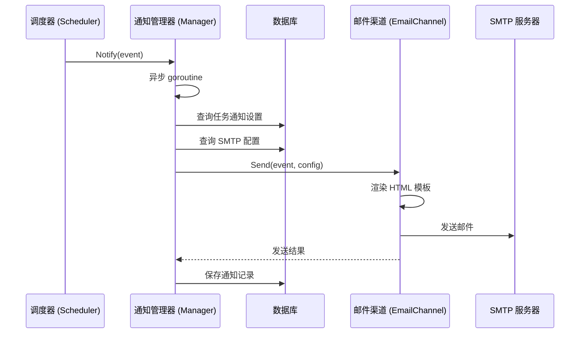

# 设计文档：邮件通知功能

## 概述

为 DNS 健康监控系统增加可扩展的通知模块，当前实现邮件通知渠道。通知模块采用接口化设计，定义统一的 `NotificationChannel` 接口，邮件渠道作为第一个实现。系统在检测到故障转移、恢复、连续失败等事件时，异步触发通知发送。

前端新增两个独立页面：通知设置页面（SMTP 配置 + 任务通知偏好）和通知记录页面（发送历史），均在侧边栏中作为独立导航项。

## 架构

### 后端架构

```
internal/notification/
├── channel.go          # NotificationChannel 接口定义 + NotificationEvent 数据结构
├── manager.go          # NotificationManager 通知管理器（加载配置、分发事件、异步发送）
├── email.go            # EmailChannel 邮件渠道实现（SMTP 发送）
└── template.go         # 邮件 HTML 模板渲染
```

通知模块通过 `NotificationManager` 统一管理，调度器在关键事件点调用 Manager 的 `Notify` 方法，Manager 异步查询任务通知设置并通过对应渠道发送。

### 前端架构

```
web/src/views/
├── NotificationSettings.vue   # 通知设置页面（SMTP 配置 + 任务通知偏好）
└── NotificationLog.vue        # 通知记录页面（发送历史）
```

### 系统集成流程



## 组件与接口

### NotificationChannel 接口

```go
// NotificationChannel 通知渠道接口，所有通知渠道需实现此接口
type NotificationChannel interface {
    // Send 发送通知，返回错误信息
    Send(ctx context.Context, event NotificationEvent, config ChannelConfig) error
    // Type 返回渠道类型标识（如 "email"）
    Type() string
}
```

### NotificationManager

```go
// NotificationManager 通知管理器
type NotificationManager struct {
    db       *gorm.DB
    channels []NotificationChannel
    encKey   []byte // 用于解密 SMTP 密码
}

// Notify 异步发送通知（不阻塞调用方）
func (m *NotificationManager) Notify(event NotificationEvent)

// TestSMTP 测试 SMTP 连接并发送测试邮件
func (m *NotificationManager) TestSMTP(ctx context.Context, config SMTPConfig) error
```

### NotificationEvent 事件数据

```go
// NotificationEvent 通知事件
type NotificationEvent struct {
    Type          EventType  // 事件类型: failover / recovery / consecutive_fail
    TaskID        uint       // 任务ID
    Domain        string     // 域名
    SubDomain     string     // 子域名
    OccurredAt    time.Time  // 事件发生时间
    // 故障转移相关
    OriginalValue string     // 原始解析值
    BackupValue   string     // 切换后解析值
    // 恢复相关
    RecoveredValue string    // 恢复后的解析值
    DownDuration   time.Duration // 故障持续时长
    // 连续失败相关
    FailCount     int        // 连续失败次数
    FailedIPs     []string   // 失败的 IP 列表
    ProbeProtocol string     // 探测协议
    ProbePort     int        // 探测端口
    HealthStatus  string     // 当前健康状态
}
```

### API 接口

```
# SMTP 配置
GET    /api/notification/smtp-config      # 获取 SMTP 配置（密码脱敏）
PUT    /api/notification/smtp-config      # 保存 SMTP 配置
POST   /api/notification/smtp-test        # 测试 SMTP 连接

# 任务通知设置
GET    /api/notification/settings         # 获取所有任务的通知设置
PUT    /api/notification/settings/:taskId # 更新单个任务的通知设置
PUT    /api/notification/settings/batch   # 批量更新通知设置（全部启用/禁用）

# 通知记录
GET    /api/notification/logs             # 获取通知发送记录（支持筛选）
```

## 数据模型

### SMTPConfig 表

```go
// SMTPConfig SMTP 邮件服务器配置
type SMTPConfig struct {
    ID                uint   `gorm:"primaryKey"`
    Host              string `gorm:"not null"`           // SMTP 服务器地址
    Port              int    `gorm:"not null"`           // SMTP 端口
    Username          string `gorm:"not null"`           // 用户名
    PasswordEncrypted string `gorm:"not null"`           // 加密后的密码
    FromAddress       string `gorm:"not null"`           // 发件人地址
    ToAddress         string `gorm:"not null"`           // 收件人地址
    CreatedAt         time.Time
    UpdatedAt         time.Time
}
```

### NotificationSetting 表

```go
// NotificationSetting 任务通知设置
type NotificationSetting struct {
    ID              uint `gorm:"primaryKey"`
    TaskID          uint `gorm:"uniqueIndex;not null"`  // 关联的探测任务ID
    NotifyFailover  bool `gorm:"default:false"`         // 是否通知故障转移
    NotifyRecovery  bool `gorm:"default:false"`         // 是否通知恢复
    NotifyConsecFail bool `gorm:"default:false"`        // 是否通知连续失败
    CreatedAt       time.Time
    UpdatedAt       time.Time
}
```

### NotificationLog 表

```go
// NotificationLog 通知发送记录
type NotificationLog struct {
    ID          uint      `gorm:"primaryKey"`
    TaskID      uint      `gorm:"index;not null"`       // 任务ID
    EventType   string    `gorm:"not null"`             // 事件类型
    ChannelType string    `gorm:"not null"`             // 渠道类型（email）
    Success     bool      `gorm:"not null"`             // 是否发送成功
    ErrorMsg    string                                   // 错误信息
    Detail      string                                   // 事件详情摘要
    SentAt      time.Time `gorm:"index;not null"`       // 发送时间
}
```

### 邮件模板设计

邮件使用 Go `html/template` 渲染，采用 HTML 表格布局确保兼容性。模板结构：

1. **封面区域**：全宽背景色块，显示系统名称 "DNS 健康监控" + 事件类型标题
2. **事件详情区域**：表格布局展示具体信息
3. **页脚区域**：系统信息和时间戳

颜色主题：
- 故障转移：红色系 (#E74C3C 主色)
- 恢复：绿色系 (#27AE60 主色)
- 连续失败告警：橙色系 (#F39C12 主色)

模板渲染函数签名：

```go
// RenderEmailHTML 渲染邮件 HTML 内容
func RenderEmailHTML(event NotificationEvent) (string, error)
```


## 正确性属性

*属性是系统在所有有效执行中应保持为真的特征或行为——本质上是关于系统应该做什么的形式化陈述。属性作为人类可读规范和机器可验证正确性保证之间的桥梁。*

### Property 1: SMTP 配置验证

*对于任意* SMTP 配置输入，当任何必填字段（Host、Port、Username、Password、FromAddress、ToAddress）为空时，验证函数应返回错误；当所有必填字段均非空时，验证函数应返回成功。

**Validates: Requirements 2.2**

### Property 2: SMTP 密码加密 round-trip

*对于任意*非空密码字符串，加密后存储的值不等于明文密码，且解密后的值等于原始密码。

**Validates: Requirements 2.4**

### Property 3: 通知分发匹配

*对于任意*事件类型和任务通知设置组合，当该事件类型在通知设置中启用时，NotificationManager 应调用渠道的 Send 方法；当该事件类型未启用时，不应调用 Send 方法。

**Validates: Requirements 3.2, 3.3, 3.4, 5.1, 5.2, 5.3**

### Property 4: 通知设置持久化 round-trip

*对于任意*有效的通知设置（TaskID + 三个布尔开关的任意组合），保存到数据库后再读取，应得到与原始设置相同的值。

**Validates: Requirements 3.5**

### Property 5: 邮件模板渲染完整性

*对于任意*有效的 NotificationEvent，渲染后的 HTML 字符串应满足：(a) 包含系统名称 "DNS 健康监控"；(b) 包含 `<table` 标签；(c) 包含该事件类型对应的所有必需字段值；(d) 包含该事件类型对应的颜色代码。

**Validates: Requirements 4.1, 4.2, 4.3, 4.4, 4.5, 4.6**

### Property 6: 通知记录持久化

*对于任意*通知发送操作（无论成功或失败），数据库中应存在对应的 NotificationLog 记录，且记录的 TaskID、EventType、ChannelType、Success 字段与发送操作一致。

**Validates: Requirements 6.1**

### Property 7: 通知记录筛选正确性

*对于任意*通知记录集合和筛选条件（TaskID 和/或 EventType），返回的结果集中每条记录都应匹配所有指定的筛选条件，且结果集应包含原始集合中所有匹配的记录。

**Validates: Requirements 6.3**

## 错误处理

| 错误场景 | 处理方式 |
|---------|---------|
| SMTP 配置未设置 | 跳过邮件发送，记录警告日志 |
| SMTP 连接失败 | 返回具体错误信息（连接超时、认证失败等） |
| 邮件发送失败 | 记录 NotificationLog（Success=false），记录错误日志 |
| 模板渲染失败 | 记录错误日志，不发送邮件 |
| 数据库操作失败 | 记录错误日志，不影响探测任务执行 |
| 通知设置不存在 | 视为所有通知类型均未启用，不发送 |

## 测试策略

### 属性测试

使用 Go 的 `gopter` 库（项目已有依赖）进行属性测试，每个属性至少运行 100 次迭代。

属性测试覆盖：
- SMTP 配置验证逻辑
- 密码加密/解密 round-trip
- 通知分发匹配逻辑（使用 mock channel）
- 通知设置持久化 round-trip（使用内存 SQLite）
- 邮件模板渲染完整性
- 通知记录持久化和筛选

### 单元测试

单元测试覆盖：
- SMTP 配置为空时跳过发送（边界条件）
- 邮件发送失败时的错误记录
- 各事件类型的模板渲染具体示例
- API handler 的请求/响应验证

### 测试配置

- 属性测试标签格式：`Feature: email-notification, Property N: {property_text}`
- 数据库测试使用 SQLite 内存模式 (`:memory:`)
- 测试完成后删除测试文件
