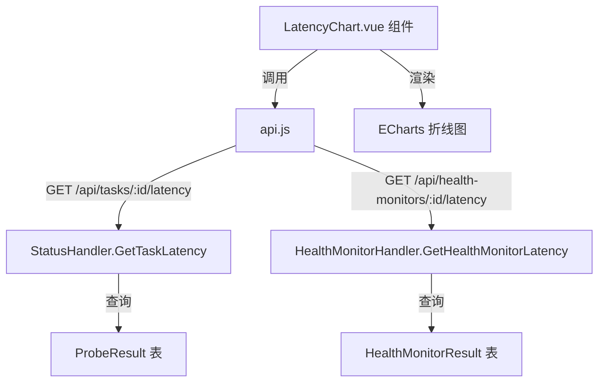

# 设计文档：延迟曲线图表

## 概述

在探测任务详情页（TaskDetail.vue）和健康监控详情页（HealthMonitorDetail.vue）的基本信息卡片上方添加延迟曲线图表组件。后端新增两个延迟数据查询 API，前端使用 ECharts 渲染折线图，支持 IP 选择和日期范围筛选。

## 架构



整体方案：
- 前端创建一个可复用的 `LatencyChart.vue` 组件，通过 props 接收 API 路径和 IP 列表
- 后端为探测任务和健康监控任务各新增一个延迟数据查询接口
- 使用 ECharts（`echarts` + `vue-echarts`）作为图表库

## 组件与接口

### 后端接口

#### 1. 探测任务延迟数据接口

- **路径**: `GET /api/tasks/:id/latency`
- **参数**:
  - `ip` (必填): IP 地址
  - `start_time` (可选): 开始时间，ISO 8601 格式，默认 24 小时前
  - `end_time` (可选): 结束时间，ISO 8601 格式，默认当前时间
- **响应**:
```json
{
  "data": [
    { "latency_ms": 15, "probed_at": "2024-01-01 12:00:00", "success": true },
    { "latency_ms": 0, "probed_at": "2024-01-01 12:00:30", "success": false }
  ]
}
```
- **实现**: 在 `StatusHandler` 中新增 `GetTaskLatency` 方法，查询 `ProbeResult` 表，按 `probed_at` 升序返回

#### 2. 健康监控延迟数据接口

- **路径**: `GET /api/health-monitors/:id/latency`
- **参数**: 同上
- **响应**: 同上
- **实现**: 在 `HealthMonitorHandler` 中新增 `GetHealthMonitorLatency` 方法，查询 `HealthMonitorResult` 表

### 前端组件

#### LatencyChart.vue（可复用组件）

**Props**:
- `apiUrl`: string — API 路径前缀（如 `/tasks/1` 或 `/health-monitors/1`）
- `ipList`: Array<string> — 可选 IP 列表
- `probeIntervalSec`: number — 检测周期（秒），用于显示粒度信息

**内部状态**:
- `selectedIp`: 当前选中的 IP
- `dateRange`: 日期范围 [startDate, endDate]
- `chartData`: 图表数据
- `loading`: 加载状态

**行为**:
- 组件挂载时，如果 ipList 非空，自动选中第一个 IP 并加载数据
- IP 或日期范围变化时，重新请求数据
- 使用 ECharts 折线图渲染，X 轴为时间，Y 轴为延迟（ms）
- 失败的探测点用红色标记

## 数据模型

不需要新增数据表。延迟数据直接从现有的 `ProbeResult` 和 `HealthMonitorResult` 表查询。

**查询逻辑**:
```sql
SELECT latency_ms, probed_at, success
FROM probe_results
WHERE task_id = ? AND ip = ? AND probed_at BETWEEN ? AND ?
ORDER BY probed_at ASC
```


## 正确性属性

*属性是系统在所有有效执行中应保持为真的特征或行为——本质上是关于系统应该做什么的形式化陈述。属性作为人类可读规范和机器可验证正确性保证之间的桥梁。*

### Property 1: 延迟数据查询结果过滤正确性

*对于任意*延迟数据查询（指定 task_id、ip、start_time、end_time），返回的每条记录都应满足：记录的 task_id 等于请求的 task_id，记录的 ip 等于请求的 ip，记录的 probed_at 在 [start_time, end_time] 范围内。

**Validates: Requirements 1.1, 1.2**

### Property 2: 延迟数据按时间升序排列

*对于任意*延迟数据查询返回的结果列表，列表中每条记录的 probed_at 时间戳应大于等于前一条记录的 probed_at 时间戳。

**Validates: Requirements 1.6**

## 错误处理

| 场景 | 处理方式 |
|------|---------|
| 缺少 IP 参数 | 后端返回 400，前端不会触发（IP 选择器必选） |
| 任务不存在 | 后端返回 404，前端显示错误提示 |
| 查询无数据 | 后端返回空数组，前端显示空状态 |
| 网络请求失败 | 前端 catch 错误，显示 ElMessage 错误提示 |
| ECharts 渲染失败 | 组件内 try-catch，显示降级提示 |

## 测试策略

### 单元测试
- 后端：测试 `GetTaskLatency` 和 `GetHealthMonitorLatency` 接口的参数验证、默认值、错误处理
- 重点测试边界情况：缺少 IP 参数返回 400、任务不存在返回 404

### 属性测试
- 使用 Go 的 `testing/quick` 或手动生成随机数据
- **Property 1**: 生成随机探测结果写入数据库，查询后验证每条结果都满足过滤条件
- **Property 2**: 对任意查询结果验证时间戳升序排列
- 每个属性测试至少运行 100 次迭代
- 标签格式: **Feature: latency-chart, Property {number}: {property_text}**

### 前端测试
- 由于前端主要是 UI 渲染和交互，不做自动化属性测试
- 通过手动测试验证图表渲染、IP 选择器、日期范围选择器的交互行为
